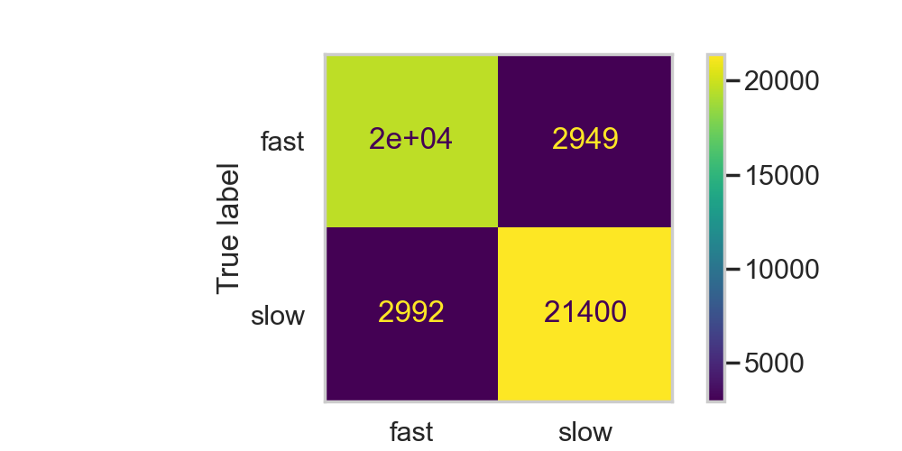
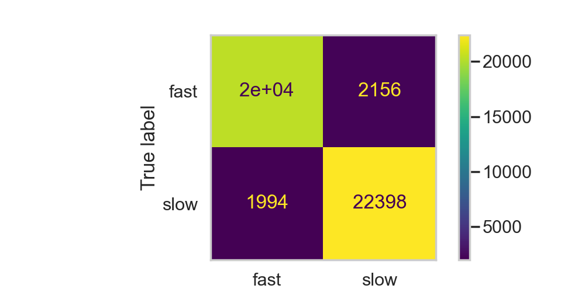

# Relationship Between Time Spent Cooking vs Ratings of a Recipe

Author: Nghi Sam

## Overview

This data science project, conducted for DSC80 at UCSD, is about finding a relation between the time spent cooking and ratings of a recipe.

## Introduction

To survive, humans need to take care of their basic needs such as eating, drinking, and sleeping. As such, some people would cook their own food, if they don't wish to buy ready-made food. After all, cooking is often considered an inexpensive, yet healthy way of obtaining food for our bodies. However, with daily activities like job and school, some people may not have much time to cook the most lavish meal, thus those people would appreciate a much more simpler recipes to follow. In this project, the goal is to find a relationship between cooking time and the rating of the recipes and eventually predict the cooking time of a recipe. The `recipes` and `interaction` dataset, scraped from [food.com](https://www.food.com/) since 2008, will be used to explore this relationship.

The first dataset, `recipes`, has 10 columns and 83782 rows for 83782 recipes. The information in each column in that dataframe table is as followed:

| **Column**       | **Description**                                                                                                                                                                                   |
|:-----------------|:--------------------------------------------------------------------------------------------------------------------------------------------------------------------------------------------------|
| `name`           | Recipe name                                                                                                                                                                                       |
| `id`             | Recipe ID                                                                                                                                                                                         |
| `minutes`        | Minutes to prepare recipe                                                                                                                                                                         |
| `contributor_id` | User ID who submitted this recipe                                                                                                                                                                 |
| `submitted`      | Date recipe was submitted                                                                                                                                                                         |
| `tags`           | [food.com](https://www.food.com/) tags for recipe                                                                                                                                                 |
| `nutrition`      | Nutrition information in the form [calories (#), total fat (PDV), sugar (PDV), sodium (PDV), protein (PDV), saturated fat (PDV), carbohydrates (PDV)]; PDV stands for “percentage of daily value” |
| `n_steps`        | Number of steps in recipe                                                                                                                                                                         |
| `steps`          | Text for recipe steps, in order                                                                                                                                                                   |
| `description`    | User-provided description                                                                                                                                                                         |

The first few rows of `recipes` is as shown below:

| **name**                           | **id** | **minutes** | **contributor_id** | **submitted** | **tags**                        | **nutrition**                                 | **n_steps** | **steps**                        | **description**                    |
|:-----------------------------------|-------:|------------:|-------------------:|:--------------|:--------------------------------|:----------------------------------------------|------------:|:---------------------------------|:-----------------------------------|
| 1 brownies in the world best ever  | 333281 | 40          | 985201             | 2008-10-27    | ['60-minutes-or-less', 'tim...] | [138.4, 10.0, 50.0, 3.0, 3.0, 19.0, 6.0]      | 10          | ['heat the oven to 350f and,...] | these are the most; chocolatey,... |
| 1 in canada chocolate chip cookies | 453467 | 45          | 1848091            | 2011-04-11    | ['60-minutes-or-less', 'tim...] | [595.1, 46.0, 211.0, 22.0, 13.0, 51.0, 26.0]  | 12          | ['pre-heat oven the 350 deg,...] | this is the recipe that we use ... |
| 412 broccoli casserole             | 306168 | 40          | 50969              | 2008-05-30    | ['60-minutes-or-less', 'tim...] | [194.8, 20.0, 6.0, 32.0, 22.0, 36.0, 3.0]     | 6           | ['preheat oven to 350 degree...] | since there are already 411 rec... |
| millionaire pound cake             | 286009 | 120         | 461724             | 2008-02-12    | ['time-to-make', 'course',...]  | [878.3, 63.0, 326.0, 13.0, 20.0, 123.0, 39.0] | 7           | ['freheat the oven to 300 de...] | why a millionaire pound cake?  ... |
| 2000 meatloaf                      | 475785 | 90          | 2202916            | 2012-03-06    | ['time-to-make', 'course',...]  | [267.0, 30.0, 12.0, 12.0, 29.0, 48.0, 2.0]    | 17          | ['pan fry bacon , and set as...] | ready, set, cook! special editi... |

The second dataset, `interactions`, has 5 columns and 731927 rows for 731927 ratings total on that website. The information in each column in that dataframe table is as followed:

| **Column**  | **Description**     |
|:------------|:--------------------|
| `user_id`   | User ID             |
| `recipe_id` | Recipe ID           |
| `date`      | Date of interaction |
| `rating`    | Rating given        |
| `review`    | Review text         |

The first few rows of `interactions` is as shown below:

| **user_id** | **recipe_id** | **date**   | **rating** | **review**                        |
|------------:|--------------:|-----------:|:-----------|----------------------------------:|
| 1293707     | 40893         | 2011-12-21 | 5          | So simple, so delicious! Great... |
| 126440      | 85009         | 2010-02-27 | 5          | I made the Mexican topping and... |
| 57222       | 85009         | 2011-10-01 | 5          | Made the cheddar bacon topping... |
| 124416      | 120345        | 2011-08-06 | 0          | Just an observation, so I will... |
| 2000192946  | 120345        | 2015-05-10 | 2          | This recipe was OVERLY too swe... |

Since I am investigating whether or not cooking time can predict the star rating of the recipe, I will mainly look at columns like `rating`, which gives the rating from 1 to 5 on the recipe being reviewed, and `minutes`, which gives the time it takes to prepare the recipe in minutes.

By exploring this question and project, I will be able to see what kind of recipe, short or long, that people care about, which will help recipe creators develop newer recipes that will align with what people want.

## Data Cleaning and Exploratory Data Analysis

The steps taken to clean our dataset before analyzing it are as followed:

1) Left merge the recipes (on `id`) and interactions (on `recipe_id`) datasets together
    
    - Allow for each recipes to be matched with its rating

| **name**                                   | **id** | **minutes** | **contributor_id** | **submitted** | **tags**                          | **nutrition**                                | **n_steps** | **steps**                    | **description**             | **user_id** | **recipe_id** | **date**   | **rating** | **review**                                 |
|:-------------------------------------------|-------:|------------:|-------------------:|:--------------|:----------------------------------|:---------------------------------------------|------------:|:-----------------------------|:----------------------------|------------:|--------------:|:-----------|-----------:|:-------------------------------------------|
| 1 brownies in the world best ever          | 333281 | 40          | 985201             | 2008-10-27    | ['60-minutes-or-less', 'time,...] | [138.4, 10.0, 50.0, 3.0, 3.0, 19.0, 6.0]     | 10          | ['heat the oven to 350f,...] | these are the most; choc... | 386585.0    | 333281.0      | 2008-11-19 | 4          | These were pretty good, but took foreve... |
| 1 in canada chocolate chip cookies         | 453467 | 45          | 1848091            | 2011-04-11    | ['60-minutes-or-less', 'time,...] | [595.1, 46.0, 211.0, 22.0, 13.0, 51.0, 26.0] | 12          | ['pre-heat oven the 350 ...] | this is the recipe that ... | 424680.0    | 453467.0      | 2012-01-26 | 5          | Originally I was gonna cut the recipe i... |
| 412 broccoli casserole                     | 306168 | 40          | 50969              | 2008-05-30    | ['60-minutes-or-less', 'time,...] | [194.8, 20.0, 6.0, 32.0, 22.0, 36.0, 3.0]    | 6           | ['preheat oven to 350 de...] | since there are already ... | 29782.0     | 306168.0      | 2008-12-31 | 5          | This was one of the best broccoli casse... |
| ...                                        | ...    | ...         | ...                | ...           | ...                               | ...                                          | ...         | ...                          | ...                         | ...         | ...           | ...        | ...        | ...                                        |
| cookies by design sugar shortbread cookies | 298509 | 20          | 506822             | 2008-04-15    | ['30-minutes-or-less', 'time,...] | [174.9, 14.0, 33.0, 4.0, 4.0, 11.0, 6.0]     | 5           | ['whip sugar and shorten...] | i've heard of the 'cooki... | 866651.0    | 298509.0      | 2008-06-19 | 1          | This recipe tastes nothing like the Coo... |
| cookies by design sugar shortbread cookies | 298509 | 20          | 506822             | 2008-04-15    | ['30-minutes-or-less', 'time,...] | [174.9, 14.0, 33.0, 4.0, 4.0, 11.0, 6.0]     | 5           | ['whip sugar and shorten...] | i've heard of the 'cooki... | 1.54628e+06 | 298509.0      | 2010-02-08 | 5          | yummy cookies, i love this recipe me an... |
| cookies by design sugar shortbread cookies | 298509 | 20          | 506822             | 2008-04-15    | ['30-minutes-or-less', 'time,...] | [174.9, 14.0, 33.0, 4.0, 4.0, 11.0, 6.0]     | 5           | ['whip sugar and shorten...] | i've heard of the 'cooki... | 1.80329e+09 | 298509.0      | 2014-11-01 | 0          | I work at a Cookies By Design and can sa...|

2) In the merged dataset, fill all ratings of 0 with np.nan. 
    
    - Typically, ratings are from 1 to 5, where 1 is the worst recipe ever and 5 is the best recipe ever. The 0, in this case, are just use to simply replace missing values, but using 0 may make the ratings lower than it actually is, therefore it is best to turn it to np.nan.

| **name**                                   | **id** | **minutes** | **contributor_id** | **submitted** | **tags**                          | **nutrition**                                | **n_steps** | **steps**                    | **description**             | **user_id** | **recipe_id** | **date**   | **rating** | **review**                                 |
|:-------------------------------------------|-------:|------------:|-------------------:|:--------------|:----------------------------------|:---------------------------------------------|------------:|:-----------------------------|:----------------------------|------------:|--------------:|:-----------|-----------:|:-------------------------------------------|
| 1 brownies in the world best ever          | 333281 | 40          | 985201             | 2008-10-27    | ['60-minutes-or-less', 'time-...] | [138.4, 10.0, 50.0, 3.0, 3.0, 19.0, 6.0]     | 10          | ['heat the oven to 350f ...] | these are the most; choc... | 386585.0    | 333281.0      | 2008-11-19 | 4.0        | These were pretty good, but took foreve... |
| 1 in canada chocolate chip cookies         | 453467 | 45          | 1848091            | 2011-04-11    | ['60-minutes-or-less', 'time-...] | [595.1, 46.0, 211.0, 22.0, 13.0, 51.0, 26.0] | 12          | ['pre-heat oven the 350 ...] | this is the recipe that ... | 424680.0    | 453467.0      | 2012-01-26 | 5.0        | Originally I was gonna cut the recipe i... |
| 412 broccoli casserole                     | 306168 | 40          | 50969              | 2008-05-30    | ['60-minutes-or-less', 'time-...] | [194.8, 20.0, 6.0, 32.0, 22.0, 36.0, 3.0]    | 6           | ['preheat oven to 350 de...] | since there are already ... | 29782.0     | 306168.0      | 2008-12-31 | 5.0        | This was one of the best broccoli casse... |
| ...                                        | ...    | ...         | ...                | ...           | ...                               | ...                                          | ...         | ...                          | ...                         | ...         | ...           | ...        | ...        | ...                                        |
| cookies by design sugar shortbread cookies | 298509 | 20          | 506822             | 2008-04-15    | ['30-minutes-or-less', 'time-...] | [174.9, 14.0, 33.0, 4.0, 4.0, 11.0, 6.0]     | 5           | ['whip sugar and shorten...] | i've heard of the 'cooki... | 866651.0    | 298509.0      | 2008-06-19 | 1.0        | This recipe tastes nothing like the Coo... |
| cookies by design sugar shortbread cookies | 298509 | 20          | 506822             | 2008-04-15    | ['30-minutes-or-less', 'time-...] | [174.9, 14.0, 33.0, 4.0, 4.0, 11.0, 6.0]     | 5           | ['whip sugar and shorten...] | i've heard of the 'cooki... | 1.54628e+06 | 298509.0      | 2010-02-08 | 5.0        | yummy cookies, i love this recipe me an... |
| cookies by design sugar shortbread cookies | 298509 | 20          | 506822             | 2008-04-15    | ['30-minutes-or-less', 'time-...] | [174.9, 14.0, 33.0, 4.0, 4.0, 11.0, 6.0]     | 5           | ['whip sugar and shorten...] | i've heard of the 'cooki... | 1.80329e+09 | 298509.0      | 2014-11-01 | NaN        | I work at a Cookies By Design and can sa...|

3) Find the average rating per recipe, `avg_rating`, and add it to the merged dataset
    
    - Since there are numerous rating per recipe, as a result of many people rating the same recipe, averaging the ratings will give a simple summary of the recipe's rating.

| **name**                                   | **id** | **minutes** | **contributor_id** | **submitted** | **tags**                          | **nutrition**                                | **n_steps** | **steps**                   | **description**             | **user_id** | **recipe_id** | **date**   | **rating** | **review**                          | **avg_rating** |
|:-------------------------------------------|-------:|------------:|-------------------:|:--------------|:----------------------------------|:---------------------------------------------|------------:|:----------------------------|:----------------------------|------------:|--------------:|:-----------|-----------:|:------------------------------------|---------------:|
| 1 brownies in the world best ever          | 333281 | 40          | 985201             | 2008-10-27    | ['60-minutes-or-less', 'time-...] | [138.4, 10.0, 50.0, 3.0, 3.0, 19.0, 6.0]     | 10          | ['heat the oven to 350f...] | these are the most; choc... | 386585.0    | 333281.0      | 2008-11-19 | 4.0        | These were pretty good, but took... | 4.0            |
| 1 in canada chocolate chip cookies         | 453467 | 45          | 1848091            | 2011-04-11    | ['60-minutes-or-less', 'time-...] | [595.1, 46.0, 211.0, 22.0, 13.0, 51.0, 26.0] | 12          | ['pre-heat oven the 350...] | this is the recipe that ... | 424680.0    | 453467.0      | 2012-01-26 | 5.0        | Originally I was gonna cut the r... | 5.0            |
| 412 broccoli casserole                     | 306168 | 40          | 50969              | 2008-05-30    | ['60-minutes-or-less', 'time-...] | [194.8, 20.0, 6.0, 32.0, 22.0, 36.0, 3.0]    | 6           | ['preheat oven to 350 d...] | since there are already ... | 29782.0     | 306168.0      | 2008-12-31 | 5.0        | This was one of the best broccol... | 5.0            |
| ...                                        | ...    | ...         | ...                | ...           | ...                               | ...                                          | ...         | ...                         | ...                         | ...         | ...           | ...        | ...        | ...                                 | ...            |
| cookies by design sugar shortbread cookies | 298509 | 20          | 506822             | 2008-04-15    | ['30-minutes-or-less', 'time-...] | [174.9, 14.0, 33.0, 4.0, 4.0, 11.0, 6.0]     | 5           | ['whip sugar and shorte...] | i've heard of the 'cooki... | 866651.0    | 298509.0      | 2008-06-19 | 1.0        | This recipe tastes nothing like ... | 3.0            |
| cookies by design sugar shortbread cookies | 298509 | 20          | 506822             | 2008-04-15    | ['30-minutes-or-less', 'time-...] | [174.9, 14.0, 33.0, 4.0, 4.0, 11.0, 6.0]     | 5           | ['whip sugar and shorte...] | i've heard of the 'cooki... | 1.54628e+06 | 298509.0      | 2010-02-08 | 5.0        | yummy cookies, i love this recip... | 3.0            |
| cookies by design sugar shortbread cookies | 298509 | 20          | 506822             | 2008-04-15    | ['30-minutes-or-less', 'time-...] | [174.9, 14.0, 33.0, 4.0, 4.0, 11.0, 6.0]     | 5           | ['whip sugar and shorte...] | i've heard of the 'cooki... | 1.80329e+09 | 298509.0      | 2014-11-01 | NaN        | I work at a Cookies By Design an... | 3.0            |

4) Turn any string orientation of date-like objects, such as `submitted` and `date`, into pd.datetime
    
    - This allows for trend-like analysis if needed

| **Column**       | **Dtype Before** |  **Dtype After** |
|:-----------------|:-----------------|:-----------------|
| `name`           | object           | object           |
| `id`             | int64            | int64            |
| `minutes`        | int64            | int64            |
| `contributor_id` | int64            | int64            |
| `submitted`      | object           | datetime64[ns]   |
| `tags`           | object           | object           |
| `nutrition`      | object           | object           |
| `n_steps`        | int64            | int64            |
| `steps`          | object           | object           |
| `description`    | object           | object           |
| `user_id`        | float64          | float64          |
| `recipe_id`      | float64          | float64          |
| `date`           | object           | datetime64[ns]   |
| `rating`         | float64          | float64          |
| `review`         | object           | object           |
| `avg_rating`     | float64          | float64          |

| **name**                                   | **id** | **minutes** | **contributor_id** | **submitted**       | **tags**                          | **nutrition**                                | **n_steps** | **steps**                   | **description**             | **user_id** | **recipe_id** | **date**            | **rating** | **review**                          | **avg_rating** |
|:-------------------------------------------|-------:|------------:|-------------------:|:--------------------|:----------------------------------|:---------------------------------------------|------------:|:----------------------------|:----------------------------|------------:|--------------:|:--------------------|-----------:|:------------------------------------|---------------:|
| 1 brownies in the world best ever          | 333281 | 40          | 985201             | 2008-10-27 00:00:00 | ['60-minutes-or-less', 'time-...] | [138.4, 10.0, 50.0, 3.0, 3.0, 19.0, 6.0]     | 10          | ['heat the oven to 350f...] | these are the most; choc... | 386585.0    | 333281.0      | 2008-11-19 00:00:00 | 4.0        | These were pretty good, but took... | 4.0            |
| 1 in canada chocolate chip cookies         | 453467 | 45          | 1848091            | 2011-04-11 00:00:00 | ['60-minutes-or-less', 'time-...] | [595.1, 46.0, 211.0, 22.0, 13.0, 51.0, 26.0] | 12          | ['pre-heat oven the 350...] | this is the recipe that ... | 424680.0    | 453467.0      | 2012-01-26 00:00:00 | 5.0        | Originally I was gonna cut the r... | 5.0            |
| 412 broccoli casserole                     | 306168 | 40          | 50969              | 2008-05-30 00:00:00 | ['60-minutes-or-less', 'time-...] | [194.8, 20.0, 6.0, 32.0, 22.0, 36.0, 3.0]    | 6           | ['preheat oven to 350 d...] | since there are already ... | 29782.0     | 306168.0      | 2008-12-31 00:00:00 | 5.0        | This was one of the best broccol... | 5.0            |
| ...                                        | ...    | ...         | ...                | ...                 | ...                               | ...                                          | ...         | ...                         | ...                         | ...         | ...           | ...                 | ...        | ...                                 | ...            |
| cookies by design sugar shortbread cookies | 298509 | 20          | 506822             | 2008-04-15 00:00:00 | ['30-minutes-or-less', 'time-...] | [174.9, 14.0, 33.0, 4.0, 4.0, 11.0, 6.0]     | 5           | ['whip sugar and shorte...] | i've heard of the 'cooki... | 866651.0    | 298509.0      | 2008-06-19 00:00:00 | 1.0        | This recipe tastes nothing like ... | 3.0            |
| cookies by design sugar shortbread cookies | 298509 | 20          | 506822             | 2008-04-15 00:00:00 | ['30-minutes-or-less', 'time-...] | [174.9, 14.0, 33.0, 4.0, 4.0, 11.0, 6.0]     | 5           | ['whip sugar and shorte...] | i've heard of the 'cooki... | 1.54628e+06 | 298509.0      | 2010-02-08 00:00:00 | 5.0        | yummy cookies, i love this recip... | 3.0            |
| cookies by design sugar shortbread cookies | 298509 | 20          | 506822             | 2008-04-15 00:00:00 | ['30-minutes-or-less', 'time-...] | [174.9, 14.0, 33.0, 4.0, 4.0, 11.0, 6.0]     | 5           | ['whip sugar and shorte...] | i've heard of the 'cooki... | 1.80329e+09 | 298509.0      | 2014-11-01 00:00:00 | NaN        | I work at a Cookies By Design an... | 3.0            |

5) Split the `nutrition` column that contains various values in the format "[calories (#), total fat (PDV), sugar (PDV), sodium (PDV), protein (PDV), saturated fat (PDV), and carbohydrates (PDV)]" into its own separate column for each data and then drop that string column completely
    
    - This allows for easy access to each individual values, like calories, fat, sugar, etc., if needed.

| **name**                                   | **id** | **minutes** | **contributor_id** | **submitted**       | **tags**                          | **n_steps** | **steps**                   | **description**             | **user_id** | **recipe_id** | **date**            | **rating** | **review**                          | **avg_rating** | **calories (#)** | **total fat (PDV)** | **sugar (PDV)** | **sodium (PDV)** | **protein (PDV)** | **saturated fat (PDV)** | **carbohydrates (PDV)** |
|:-------------------------------------------|-------:|------------:|-------------------:|:--------------------|:----------------------------------|------------:|:----------------------------|:----------------------------|------------:|--------------:|:--------------------|-----------:|:------------------------------------|---------------:|-----------------:|--------------------:|----------------:|-----------------:|------------------:|------------------------:|------------------------:|
| 1 brownies in the world best ever          | 333281 | 40          | 985201             | 2008-10-27 00:00:00 | ['60-minutes-or-less', 'time-...] | 10          | ['heat the oven to 350f...] | these are the most; choc... | 386585.0    | 333281.0      | 2008-11-19 00:00:00 | 4.0        | These were pretty good, but took... | 4.0            | 138.4            | 10.0                | 50.0            | 3.0              | 3.0               | 19.0                    | 6.0                     |
| 1 in canada chocolate chip cookies         | 453467 | 45          | 1848091            | 2011-04-11 00:00:00 | ['60-minutes-or-less', 'time-...] | 12          | ['pre-heat oven the 350...] | this is the recipe that ... | 424680.0    | 453467.0      | 2012-01-26 00:00:00 | 5.0        | Originally I was gonna cut the r... | 5.0            | 595.1            | 46.0                | 211.0           | 22.0             | 13.0              | 51.0                    | 26.0                    |
| 412 broccoli casserole                     | 306168 | 40          | 50969              | 2008-05-30 00:00:00 | ['60-minutes-or-less', 'time-...] | 6           | ['preheat oven to 350 d...] | since there are already ... | 29782.0     | 306168.0      | 2008-12-31 00:00:00 | 5.0        | This was one of the best broccol... | 5.0            | 194.8            | 20.0                | 6.0             | 32.0             | 22.0              | 36.0                    | 3.0                     |
| ...                                        | ...    | ...         | ...                | ...                 | ...                               | ...         | ...                         | ...                         | ...         | ...           | ...                 | ...        | ...                                 | ...            | ...              | ...                 | ...             | ...              | ...               | ...                     | ...                     |
| cookies by design sugar shortbread cookies | 298509 | 20          | 506822             | 2008-04-15 00:00:00 | ['30-minutes-or-less', 'time-...] | 5           | ['whip sugar and shorte...] | i've heard of the 'cooki... | 866651.0    | 298509.0      | 2008-06-19 00:00:00 | 1.0        | This recipe tastes nothing like ... | 3.0            | 174.9            | 14.0                | 33.0            | 4.0              | 4.0               | 11.0                    | 6.0                     |
| cookies by design sugar shortbread cookies | 298509 | 20          | 506822             | 2008-04-15 00:00:00 | ['30-minutes-or-less', 'time-...] | 5           | ['whip sugar and shorte...] | i've heard of the 'cooki... | 1.54628e+06 | 298509.0      | 2010-02-08 00:00:00 | 5.0        | yummy cookies, i love this recip... | 3.0            | 174.9            | 14.0                | 33.0            | 4.0              | 4.0               | 11.0                    | 6.0                     |
| cookies by design sugar shortbread cookies | 298509 | 20          | 506822             | 2008-04-15 00:00:00 | ['30-minutes-or-less', 'time-...] | 5           | ['whip sugar and shorte...] | i've heard of the 'cooki... | 1.80329e+09 | 298509.0      | 2014-11-01 00:00:00 | NaN        | I work at a Cookies By Design an... | 3.0            | 174.9            | 14.0                | 33.0            | 4.0              | 4.0               | 11.0                    | 6.0                     |

6) Turn the `steps` column, which is in string format, into list of separate steps
    
    - Allows for easy access to individual steps required in a recipe if needed without having to split the string everytime it is used

7) Turn the `tags` column, which is in string format, into list of separate tags
    
    - Allows for easy access to individual tags in case I need to find recipe of a certain tags

8) Categorized and add a column `cooking_speed` that contains whether the cooking time is 'slow' (longer than 35 minutes) or 'fast' (35 minutes or shorter) relative to the rest of the other recipes.
    
    - Allow for a way to compare between each recipe's cooking length and its rating as a group without us having to looking at each individual minutes separately creating 587 separate comparison of ratings (587 unique 'minutes' values). The '35' minute mark was calculated using the median distribution of cooking time to ensure it is not affected by outliers. After that, I categorized it into 'fast' and 'slow' based on if it is in the first 50 percentile of the 'minutes' data or the last 50 percentile.

| **name**                                   | **id** | **minutes** | **contributor_id** | **submitted**       | **tags**                          | **n_steps** | **steps**                   | **description**             | **user_id** | **recipe_id** | **date**            | **rating** | **review**                          | **avg_rating** | **calories (#)** | **total fat (PDV)** | **sugar (PDV)** | **sodium (PDV)** | **protein (PDV)** | **saturated fat (PDV)** | **carbohydrates (PDV)** | **cooking_speed** |
|:-------------------------------------------|-------:|------------:|-------------------:|:--------------------|:----------------------------------|------------:|:----------------------------|:----------------------------|------------:|--------------:|:--------------------|-----------:|:------------------------------------|---------------:|-----------------:|--------------------:|----------------:|-----------------:|------------------:|------------------------:|------------------------:|------------------:|
| 1 brownies in the world best ever          | 333281 | 40          | 985201             | 2008-10-27 00:00:00 | ['60-minutes-or-less', 'time-...] | 10          | ['heat the oven to 350f...] | these are the most; choc... | 386585.0    | 333281.0      | 2008-11-19 00:00:00 | 4.0        | These were pretty good, but took... | 4.0            | 138.4            | 10.0                | 50.0            | 3.0              | 3.0               | 19.0                    | 6.0                     | slow              |
| 1 in canada chocolate chip cookies         | 453467 | 45          | 1848091            | 2011-04-11 00:00:00 | ['60-minutes-or-less', 'time-...] | 12          | ['pre-heat oven the 350...] | this is the recipe that ... | 424680.0    | 453467.0      | 2012-01-26 00:00:00 | 5.0        | Originally I was gonna cut the r... | 5.0            | 595.1            | 46.0                | 211.0           | 22.0             | 13.0              | 51.0                    | 26.0                    | slow              |
| 412 broccoli casserole                     | 306168 | 40          | 50969              | 2008-05-30 00:00:00 | ['60-minutes-or-less', 'time-...] | 6           | ['preheat oven to 350 d...] | since there are already ... | 29782.0     | 306168.0      | 2008-12-31 00:00:00 | 5.0        | This was one of the best broccol... | 5.0            | 194.8            | 20.0                | 6.0             | 32.0             | 22.0              | 36.0                    | 3.0                     | slow              |
| ...                                        | ...    | ...         | ...                | ...                 | ...                               | ...         | ...                         | ...                         | ...         | ...           | ...                 | ...        | ...                                 | ...            | ...              | ...                 | ...             | ...              | ...               | ...                     | ...                     | ...               |
| cookies by design sugar shortbread cookies | 298509 | 20          | 506822             | 2008-04-15 00:00:00 | ['30-minutes-or-less', 'time-...] | 5           | ['whip sugar and shorte...] | i've heard of the 'cooki... | 866651.0    | 298509.0      | 2008-06-19 00:00:00 | 1.0        | This recipe tastes nothing like ... | 3.0            | 174.9            | 14.0                | 33.0            | 4.0              | 4.0               | 11.0                    | 6.0                     | fast              |
| cookies by design sugar shortbread cookies | 298509 | 20          | 506822             | 2008-04-15 00:00:00 | ['30-minutes-or-less', 'time-...] | 5           | ['whip sugar and shorte...] | i've heard of the 'cooki... | 1.54628e+06 | 298509.0      | 2010-02-08 00:00:00 | 5.0        | yummy cookies, i love this recip... | 3.0            | 174.9            | 14.0                | 33.0            | 4.0              | 4.0               | 11.0                    | 6.0                     | fast              |
| cookies by design sugar shortbread cookies | 298509 | 20          | 506822             | 2008-04-15 00:00:00 | ['30-minutes-or-less', 'time-...] | 5           | ['whip sugar and shorte...] | i've heard of the 'cooki... | 1.80329e+09 | 298509.0      | 2014-11-01 00:00:00 | NaN        | I work at a Cookies By Design an... | 3.0            | 174.9            | 14.0                | 33.0            | 4.0              | 4.0               | 11.0                    | 6.0                     | fast              |

After cleaning, the dataframe ended up with 234429 rows and 23 columns, with the following information:

| **Column**            | **Description**                                                                                        | **Dtype**      |
|:----------------------|:-------------------------------------------------------------------------------------------------------|:---------------|
| `name`                | Recipe name                                                                                            | object         |
| `id`                  | Recipe ID                                                                                              | int64          |
| `minutes`             | Minutes to prepare recipe                                                                              | int64          |
| `contributor_id`      | User ID who submitted this recipe                                                                      | int64          |
| `submitted`           | Date recipe was submitted                                                                              | datetime64[ns] |
| `tags`                | [food.com](https://www.food.com/) tags for recipe                                                      | object         |
| `n_steps`             | Number of steps in recipe                                                                              | int64          |
| `steps`               | Text for recipe steps, in order                                                                        | object         |
| `description`         | User-provided description                                                                              | object         |
| `user_id`             | User ID                                                                                                | float64        |
| `recipe_id`           | Recipe ID                                                                                              | float64        |
| `date`                | Date of interaction                                                                                    | datetime64[ns] |
| `rating`              | Rating given                                                                                           | float64        |
| `review`              | Review text                                                                                            | object         |
| `avg_rating`          | Average rating of a recipe                                                                             | float64        |
| `calories (#)`        | Calories of a recipe (in kcal)                                                                         | float64        |
| `total fat (PDV)`     | Recipe's total fat in percentage of daily value                                                        | float64        |
| `sugar (PDV)`         | Recipe's sugar in percentage of daily value                                                            | float64        |
| `sodium (PDV)`        | Recipe's sodium in percentage of daily value                                                           | float64        |
| `protein (PDV)`       | Recipe's protein in percentage of daily value                                                          | float64        |
| `saturated fat (PDV)` | Recipe's saturated fat in percentage of daily value                                                    | float64        |
| `carbohydrates (PDV)` | Recipe's carbohydrates in percentage of daily value                                                    | float64        |
| `cooking_speed`       | Speed relative to other recipes on website (fast (within 35 minutes) or slow (longer than 35 minutes)) | object         |

Below is a small display of the first 5 rows to show what the cleaned dataframe contains:

| **name**                           | **id** | **minutes** | **contributor_id** | **submitted**       | **tags**                         | **n_steps** | **steps**                   | **description**                 | **user_id** | **recipe_id** | **date**            | **rating** | **review**                   | **avg_rating** | **calories (#)** | **total fat (PDV)** | **sugar (PDV)** | **sodium (PDV)** | **protein (PDV)** | **saturated fat (PDV)** | **carbohydrates (PDV)** | **cooking_speed** |
|:-----------------------------------|-------:|------------:|-------------------:|:--------------------|:---------------------------------|------------:|:----------------------------|:--------------------------------|------------:|--------------:|:--------------------|-----------:|:-----------------------------|---------------:|-----------------:|--------------------:|----------------:|-----------------:|------------------:|------------------------:|------------------------:|------------------:|
| 1 brownies in the world best ever  | 333281 | 40          | 985201             | 2008-10-27 00:00:00 | ['60-minutes-or-less', 'time...] | 10          | ['heat the oven to 350f...] | these are the most; chocolat... | 386585.0    | 333281.0      | 2008-11-19 00:00:00 | 4.0        | These were pretty good, b... | 4.0            | 138.4            | 10.0                | 50.0            | 3.0              | 3.0               | 19.0                    | 6.0                     | slow              |
| 1 in canada chocolate chip cookies | 453467 | 45          | 1848091            | 2011-04-11 00:00:00 | ['60-minutes-or-less', 'time...] | 12          | ['pre-heat oven the 350...] | this is the recipe that we u... | 424680.0    | 453467.0      | 2012-01-26 00:00:00 | 5.0        | Originally I was gonna cu... | 5.0            | 595.1            | 46.0                | 211.0           | 22.0             | 13.0              | 51.0                    | 26.0                    | slow              |
| 412 broccoli casserole             | 306168 | 40          | 50969              | 2008-05-30 00:00:00 | ['60-minutes-or-less', 'time...] | 6           | ['preheat oven to 350 d...] | since there are already 411 ... | 29782.0     | 306168.0      | 2008-12-31 00:00:00 | 5.0        | This was one of the best ... | 5.0            | 194.8            | 20.0                | 6.0             | 32.0             | 22.0              | 36.0                    | 3.0                     | slow              |
| 412 broccoli casserole             | 306168 | 40          | 50969              | 2008-05-30 00:00:00 | ['60-minutes-or-less', 'time...] | 6           | ['preheat oven to 350 d...] | since there are already 411 ... | 1196280.0   | 306168.0      | 2009-04-13 00:00:00 | 5.0        | I made this for my son's ... | 5.0            | 194.8            | 20.0                | 6.0             | 32.0             | 22.0              | 36.0                    | 3.0                     | slow              |
| 412 broccoli casserole             | 306168 | 40          | 50969              | 2008-05-30 00:00:00 | ['60-minutes-or-less', 'time...] | 6           | ['preheat oven to 350 d...] | since there are already 411 ... | 768828.0    | 306168.0      | 2013-08-02 00:00:00 | 5.0        | Loved this. Be sure to co... | 5.0            | 194.8            | 20.0                | 6.0             | 32.0             | 22.0              | 36.0                    | 3.0                     | slow              |

### Univariate Analysis

In this analysis, the distribution of the ratings for all recipes were examined. The plot below shows a distribution that is skewed left, meaning that most people rate the recipe they use very highly.

<iframe
  src="assets/rating_dist.html"
  width="800"
  height="600"
  frameborder="0"
></iframe>

In addition to analyzing the distribution of the recipe's rating, I also analyze the distribution of the amount of time, in minutes, to cook the recipe. 

<iframe
  src="assets/unzoomed_minute_dist.html"
  width="800"
  height="600"
  frameborder="0"
></iframe>

Since the `minutes` column has a huge range due to the inclusion of outliers, it will cause any plots generated with `minutes` to be super thin and hard to see clear data, therefore any plots generated here involving `minutes` will include another plot where the range is only within the valid bounds, [Q1 - 1.5(IQR), Q3 + 1.5(IQR)]. As the distrbution never goes below 0, the outlier will never reach the lower bound, so we instead plot the graph within the bound, [0, Q3 + 1.5(IQR)]. The plot seems to reveal a distribution that is skewed right, meaning most of the recipe has a cooking time on the lower end, which is less than 1 hour (60 minutes). The decreasing trend in the histogram indicates that as the cooking time gets longer, there are less of those recipes displayed on [food.com](https://www.food.com/).

<iframe
  src="assets/minute_dist.html"
  width="800"
  height="600"
  frameborder="0"
></iframe>

### Bivariate Analysis

In this bivariate analysis of two variables, the average rating of the recipe and the time it took to cook the food was examined with a scatterplot. It was noticed that the graph gives off a logarithm shape mainly due to the fact that most of the data is clustered around a high average rating and a low cooking time. It also seems that as the cooking time gets higher, there appears to be less ratings along with less lower average ratings. This could be interpreted as the higher the cooking time, the less likely people are going to be using that recipes, thus less ratings in general for those recipes. With less ratings, the people who does use that recipe will probably like it a lot, which was why they used it in the first place, making recipes with higher cooking time appear to be more well-liked. 

<iframe
  src="assets/unzoomed_time_rating_scat.html"
  width="800"
  height="600"
  frameborder="0"
></iframe>

Zooming in closer:

<iframe
  src="assets/time_rating_scat.html"
  width="800"
  height="600"
  frameborder="0"
></iframe>

### Interesting Aggregates

In this section, the relationship between cooking time (in minutes) and the rating is investigated. From the table and the line plot, it seems that the longer the recipe takes, the more likely it is for the minimum rating to vary, which could mean that long recipes does not necessarily mean it is always good, nor is it always bad.

| **minutes** | **rating_count** | **rating_mean** | **rating_std** | **rating_min** | **rating_25%** |  **rating_50%** | **rating_75%** | **rating_max** |
|------------:|-----------------:|----------------:|---------------:|---------------:|---------------:|----------------:|---------------:|---------------:|
| 0           | 3.0              | 5.00            | 0.00           | 5.0            | 5.0            | 5.0             | 5.0            | 5.0            |
| 1           | 702.0            | 4.79            | 0.58           | 1.0            | 5.0            | 5.0             | 5.0            | 5.0            |
| 2           | 2633.0           | 4.76            | 0.56           | 1.0            | 5.0            | 5.0             | 5.0            | 5.0            |
| ...         | ...              | ...             | ...            | ...            | ...            | ...             | ...            | ...            |
| 259205      | 1.0              | 5.00            | NaN            | 5.0            | 5.0            | 5.0             | 5.0            | 5.0            |
| 288000      | 1.0              | 4.00            | NaN            | 4.0            | 4.0            | 4.0             | 4.0            | 4.0            |
| 1051200     | 2.0              | 5.00            | 0.00           | 5.0            | 5.0            | 5.0             | 5.0            | 5.0            |

<iframe
  src="assets/unzoomed_time_star_describe.html"
  width="800"
  height="600"
  frameborder="0"
></iframe>

Zooming in closer to see a clear pattern:

| **minutes** | **rating_count** | **rating_mean** | **rating_std** | **rating_min** | **rating_25%** |  **rating_50%** | **rating_75%** | **rating_max** |
|------------:|-----------------:|----------------:|---------------:|---------------:|---------------:|----------------:|---------------:|---------------:|
| 0           | 3.0              | 5.00            | 0.00           | 5.0            | 5.0            | 5.0             | 5.0            | 5.0            |
| 1           | 702.0            | 4.79            | 0.58           | 1.0            | 5.0            | 5.0             | 5.0            | 5.0            |
| 2           | 2633.0           | 4.76            | 0.56           | 1.0            | 5.0            | 5.0             | 5.0            | 5.0            |
| ...         | ...              | ...             | ...            | ...            | ...            | ...             | ...            | ...            |
| 117         | 1.0              | 4.00            | NaN            | 4.0            | 4.0            | 4.0             | 4.0            | 4.0            |
| 118         | 2.0              | 5.00            | 0.00           | 5.0            | 5.0            | 5.0             | 5.0            | 5.0            |
| 120         | 1145.0           | 4.66            | 0.78           | 1.0            | 5.0            | 5.0             | 5.0            | 5.0            |

<iframe
  src="assets/time_star_describe.html"
  width="800"
  height="600"
  frameborder="0"
></iframe>

## Assessment of Missingness

| **Column**            | **Number Missing** |
|:----------------------|-------------------:|
| `name`                | 1                  |
| `id`                  | 0                  |
| `minutes`             | 0                  |
| `contributor_id`      | 0                  |
| `submitted`           | 0                  |
| `tags`                | 0                  |
| `n_steps`             | 0                  |
| `steps`               | 0                  |
| `description`         | 114                |
| `user_id`             | 1                  |
| `recipe_id`           | 1                  |
| `date`                | 1                  |
| `rating`              | 15036              |
| `review`              | 58                 |
| `avg_rating`          | 2777               |
| `calories (#)`        | 0                  |
| `total fat (PDV)`     | 0                  |
| `sugar (PDV)`         | 0                  |
| `sodium (PDV)`        | 0                  |
| `protein (PDV)`       | 0                  |
| `saturated fat (PDV)` | 0                  |
| `carbohydrates (PDV)` | 0                  |
| `cooking_speed`       | 0                  |

It seems that there are a few significant missing columns like, `description`, `rating`, and `review` in the merged dataset. Although `avg_rating` also seem to have some missing values, it was calculated by us based on `rating`, therefore it is best to examine the missingness of `rating` if I want to find out the missingness of `avg_rating`.

### NMAR Analysis

It is believed that the `review` column in the dataset is Not Missing At Random (NMAR). Based on personal experience, not everyone review the things they use or buy. Only those that have a strong incentive, like if they recieve discount for reviewing, would leave a review, otherwise, it would be deemed too cumbersome by some to write a few sentences regarding the product. This idea can also be applied to reviewing the recipes online. People here may leave a review on the recipe if they can either promote it even more or drag it down if they really hate it; people in-between who may seen that their opinions were somewhat expressed would not bother to write another one. Additional data like whether or not they strongly agree, agree, feel neutral, disagree, or strongly disagree about the current review of the recipe would help explain the data's missingness, thus making it Missing At Random (MAR) in this senario. 

### Missingness Dependency

#### Rating Missingness Based On Minutes

**Null Hypothesis:** The distribution of column `minutes` when the column `rating` is missing and the distribution of column `minutes` when column `rating` is not missing are the same.

**Alternative Hypothesis:** The distribution of column `minutes` when the column `rating` is missing and the distribution of column `minutes` when column `rating` is not missing are different.

**Significance Level:** p = 0.05

<iframe
  src="assets/unzoomed_missing_time.html"
  width="800"
  height="600"
  frameborder="0"
></iframe>

Due to the outliers, I shall zoom into where the main part of the data is to see the two distributions more clearly.

<iframe
  src="assets/missing_time.html"
  width="800"
  height="600"
  frameborder="0"
></iframe>

Noticing how the mean in cooking time differs greatly between whether or not rating is missing, it is safe to say I don't need to use the KS-test statistic and that the absolute difference in group means of cooking time would be sufficient.

**Test Statistic:** Absolute difference in group mean of cooking time (in minutes) between missing rating and non-missing rating

<iframe
  src="assets/empirical_dist_minutes.html"
  width="800"
  height="600"
  frameborder="0"
></iframe>

Since the p-value is 0.096, which is greater than the significance level of 0.05, I fail to reject the null hypothesis, thus I can conclude that the missingness of rating does not depend on the cooking time (in minutes) of the recipe.

#### Rating Missingness Based On Calories

**Null Hypothesis:** The distribution of column `calories (#)` when the column `rating` is missing and the distribution of column `calories (#)` when column `rating` is not missing are the same.

**Alternative Hypothesis:** The distribution of column `calories (#)` when the column `rating` is missing and the distribution of column `calories (#)` when column `rating` is not missing are different.

**Significance Level:** p = 0.05

<iframe
  src="assets/unzoomed_missing_calories_time.html"
  width="800"
  height="600"
  frameborder="0"
></iframe>

Due to the large range of data involving calories, I shall zoom into the first 5000 calories, where most of the datas are.

<iframe
  src="assets/missing_calories_time.html"
  width="800"
  height="600"
  frameborder="0"
></iframe>

Although the means in the data distribution does not look significantly different, the actual absolute mean difference, 69.01, which is calculated using 415.10, the mean calories of ratings that are not missing, and 484.11, the mean calories of ratings that are missing, does not appear to be small. Therefore, it is safe to say that a KS test statistic is not needed and that the absolute difference in mean of calories between the two group is sufficient.

**Test Statistic:** Absolute difference in mean of calories between the two group

<iframe
  src="assets/empirical_dist_calories_missing.html"
  width="800"
  height="600"
  frameborder="0"
></iframe>

Since the p-value is 0.0, which is much less than the significance level of 0.05, I reject the null hypothesis, thus it can conclude that the missingness of rating does depend on the `calories (#)` of the recipe.

## Hypothesis Testing

Here, I will be testing to see if there is any sort of relationship between the recipe's rating and its cooking time, specifically if the ratings gets higher for shorter cooking time. This is because I believe that due to time constraints in most people's lives, most of them would prefer a shorter recipe to cook. By short and long recipes, I meant the recipes that are longer or shorter than most of the recipes (median cooking time) in the dataset, therefore I will refer to the `cooking_speed` column found above for this test. 

Since we are looking at the differences between two sample distribution without knowning what the population distribution is, we will be using the permutation test to test the following hypothesis.

**Null Hypothesis:** The rating for recipe is the same across all cooking time (fast and slow).

**Alternative Hypothesis:** The rating of the recipes are higher for recipes that takes a shorter cooking time.

**Test Statistic:** Difference in mean rating between fast (<= 35 minutes) and slow (> 35 minutes) recipes

**Significance Level:** p = 0.05

The reason why this specific test statistic, difference in mean, was chosen is due to the fact that the test is a one sided, directional test to see if shorter recipes have high ratings. Furthermore, the mean rating was specifically chosen instead of the mean average ratings because the average ratings would not be able to capture all the nuance of individual ratings that are lower than average or higher than average.

<iframe
  src="assets/empirical_dist_rating.html"
  width="800"
  height="600"
  frameborder="0"
></iframe>

Since the p-value is 0.0, which is significantly less than the chosen significant level 0.05, we reject the null hypothesis that the rating for recipes is the same across all cooking time, slow and fast. It seems people do not rate all recipes in the same way, and tend to rate shorter recipes more highly. A possible explanation could be that shorter recipes are more convenient for those on a time crunch.

## Framing a Prediction Problem

As the introduction stated, this project will focus on predicting cooking time of a recipe, mainly if it is a fast or slow recipe. The reason why we specifically chose to predict categories rather than numbers is because considering the large outliers in the `minutes` columns, it will be hard for any regression line to accurately predict the outliers, leading to high errors. As such, if we split it into two categories, 'fast' and 'slow' cooking, the outliers would also be captured accurately, placing it into 'slow' cooking. Therefore, this would be a classification problem, mainly a binary classification problem, since the variable being outputted is a nominal categorical variable, with two selection, 'fast' and 'slow'. The cooking speed of the recipe, 'fast' or 'slow', represented by the column `cooking_speed`, will be chosen as the response variable because it is exactly what we want to predict as phrased by our prediction problem. To evaluate the model, I will be using accuracy. This is because although the `minutes` column was originally skewed positively, where most `minutes` are in the lower ends, we eventually split it into two approxiately even groups, 'slow' (0.48) and 'fast' (0.52), in the column `cooking_speed`. As the groups are now approximately even, using accuracy would be the best. The information we will have at the time of our prediction would be all the columns in the original `Recipes` dataset, like `name`, `minutes`, `submitted`, and `n_steps`, because they are all information about the recipes themselves. Recipe informations would be the first thing we have access to, even way before Ratings appear.

## Baseline Model

For the baseline model, I went with a simple deicison tree model with default hyperparameters. After splitting the data points into training and test set with the 80-20 split, I choose the two feature, `calories (#)` and `sugar (PDV)`, which are both continuous quantitative variables. Since, numerical values are used, there is no need to transform any columns, so we kept the numerical as is and put a `DecisionTreeClassifier` through the `Pipeline`.

The accuracy metric for this model is approximately 0.87, which is pretty good because without any transformation, it has already been able to predict the majority of the class correctly. Additionally it was able to predict both correctly at an equal proportion with no imbalance. In this base model prediction, 0.85 of the 'fast' and 0.86 of the 'slow' label are correctly predicted.

Here is our baseline prediction confusion matrix:

## Final Model

In the final model, the features that were used are `calories (#)`, `sodium (PDV)`, `protein (PDV)`, and `n_steps`. 

`calories (#)`

The column gives the calories of the recipe in kcal units. When we construct a scatterplot between the relationship of the times in minute and the calories, we recieved a decreasing curve. When the calories increase, the time it takes to make it decrease and the variability also converge to a lower cooking time. This appears to make sense because when cooking the food, sometimes we are burning away fat, thus decreasing calories from the original raw food. Therefore, when there are more variability in cooking time near when the calories are in the low end, because some food starts with low calories and some food are cooked too much they have low calories. However, as calories increases, the cooking time seem to decrease as that's where the food has it's max original calories. 

For this columm, I use `RobustScaler` to transform the column because while it looks normally distributed towards the lower end, it contains many large outliers, which may influence the model, therefore a transformation, like `RobustScaler`, that can handle outliers, is selected.

`sodium (PDV)`

This column gives the number of sodium in the recipe by its percent daily value. From the scatterplot relationship graph, we also noticed a decreasing curve trend, which can be caused by the salt leaving the food and transferring to the pan and pot. For example, long cooking time, which more likely happens if we boil food than fry food, would have less salt because most of the salt would leak to the water. However, if we fry the food, less cooking time else the food would burn, most of the salt would stay in the food.

Here, a log transformation, using `FunctionTransformer` is used, because the data for sodium is highly skewed to the right, causing a downward curve trend in the scatterplot.

`protein (PDV)`

This column gives the number of protein in the recipe by its percent daily value. Cooking can dilute protein and denature protein depending on how it is cooked, therefore decreasing it the more it is cooked. Therefore, when the cooking time is 0, there are more variability in level of protein, but as the cooking time gets higher, most cooking level concentrate around the lower ends.

A `FunctionTransformer` of log is also used here, because the data for protein is also extremely skewed to the right, causing a downward curve trend in the scatterplot.

`n_steps`

This column contains the number of steps the recipe takes to complete. The reason why `n_steps` is included is because we expected that longer recipes to take more steps to make, which is true for the most part. From the line plot, we noticed an increasing trend of minutes in the mean and minimum value as steps increases. However, the variability in minutes also increases as steps increases.

Here, a `QuantileTransformer` is used because when the relationship between `minutes` and `n_steps` was plotted, it looks like it is between a uniform distribution and a normal distribution. We decided to put it through quantile transformer so that it can be transformed to one or the other more definitively. Rather than choosing one or the other here, we also put this through a `GridSearchCV`, so it can choose one distribution for the `QuantileTransformer`.

The final modeling algorithm that was chosen is the `DecisionTreeClassifier` with more specific hyperparameters. Using `GridSearchCV`, in addition to tuning `output_distribution` of the `QuantileTransformer` as mentioned above, the `max_depth`, `min_samples_split`, and `criterion` of the tree was also tuned decision trees are known to overfit and will be more likely to misclassified testing dataset if overfitting happen, therefore, these hyperparameters are tuned to prevent misclassification and overfitting.

In the end, with the final best hyperparameters chosen after tuning, which are 'normal' `output_distribution`, 'entropy' `criterion`, '150' `max_depth`, and '2' `min_samples_split`, we recieve an accuracy score of approximately 0.91, which is a 0.04 increase from the baseline model. Additionally, the individual accuracy of both group prediction also improved, where 0.89 of the 'fast' and 0.91 of the 'slow' label are correctly predicted. Furthmore, this final model does not create a classification imbalanced where one class is more likely to be correctly predicted, which is great.

Below is our final prediction confusion matrix:

## Fairness Analysis

For the fairness analysis, due to the balance in the class of the classifier, I chose to evaluate the **accuracy parity** of the group, high and low, sodium. The reason sodium is chosen is because sodium is very important in health and cooking, therefore, we wish to avoid discrimination as much as possible here. Too much sodium means high blood pressure and too little means hyponatremia. The high sodium group is where `sodium (PDV)` is greater than or equal to 20 and the low sodium group is where `sodium (PDV)` is less than 20. The number 20 is from health fact stating that 20% or more sodium daily value is considered high sodium.

**Null Hypothesis:** Our model is fair. The classifier's accuracy is the same for both high and low sodium recipes, and any differences are due to random chance.

**Alternative Hypothesis:** Our model is unfair. The classifier's accuracy is higher for low sodium recipe.

**Test Statistic:** Difference in accuracy (low - high)

**Significance Level:** 0.05

<iframe
  src="assets/accuracy_dist.html"
  width="800"
  height="600"
  frameborder="0"
></iframe>

After creating the column `is_salty` to group high and low sodium recipe, a permutation test is ran 500 times. The observed test statistic was 0.004 and the p-value is 0.062. Since the p-value is larger than our significance level of 0.05, we fail to reject the null hypothesis that our model is fair, therefore we cannot conclude that our model is unfair and that the classifier's accuracy is higher for low sodium recipe.